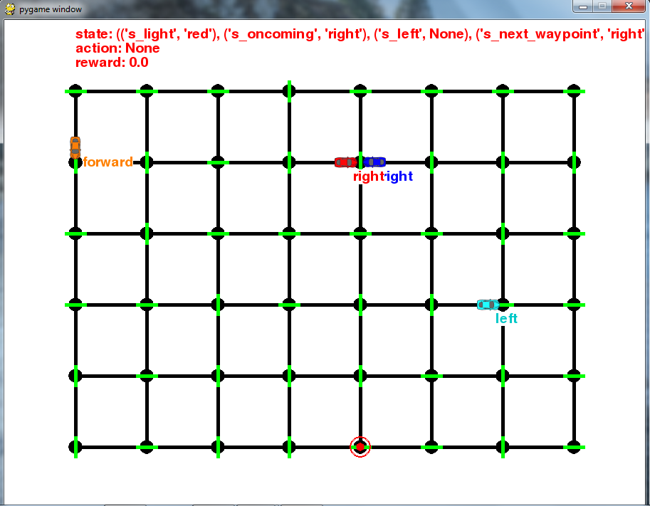
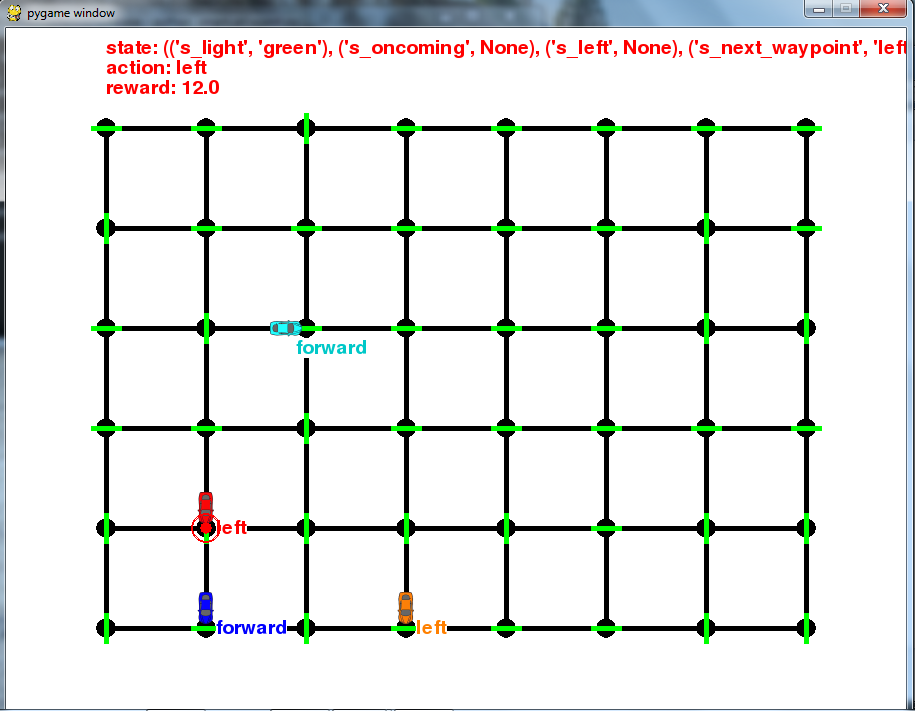
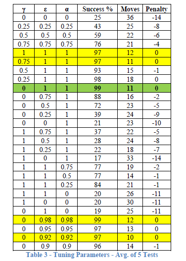

# Smartcab
This repository contains project files for ‘Project 4 - Train a Smartcab to Drive’ as part of Udacity's Machine Learning Nanodegree. Questions posed by Udacity and my answers to those questions can be found in 'Report.pdf'.

In this project, I explore the process of how a smartcab can learn from its environment to best achieve a goal- reaching its destination while following traffic rules. Cabs capable of movement and their environment are provided by Udacity. Without any kind of learning, these default cabs wander aimlessly, sometimes only reaching their destinations by chance. I describe the features of the environment, and how they can be simplified to make the learning process easier. Finally, a Q-learning is introduced and tuned to help the smartcab reach its destination 99% of the time without violating traffic rules. 

Starter files provided by Udacity are in the 'Smartcab Starter Files' folder. 

## How to run the program

From the top level of the 'Final Smartcab' folder, run:

```python smartcab/agent.py```

## Screenshots
Below are a few screenshots showing features of this project.








This project requires **Python 2.7** and the following Python libraries installed:

- [pygame](https://www.pygame.org/wiki/GettingStarted#Pygame_Installation)
